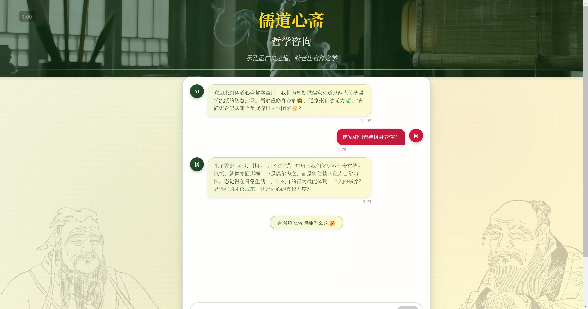

# 基于LLM的儒道心斋哲学咨询系统

一个基于React和Coze API构建的单页面应用，旨在为用户提供一个与儒家、道家及混合策略AI进行哲学对话的交互式聊天界面。


*主界面*

## ✨ 核心特性

- **智能AI分流**：对话始于一个混合策略AI，它能分析用户问题，并智能地将其分派给儒家或道家视角进行深度解答。
- **动态视角切换**：在得到任一学派的回复后，可一键切换，无缝获取另一学派对同一问题的见解。
- **流式对话与自我修复**：实现与AI的实时流式对话。
- **沉浸式古典设计**：页头在桌面端采用动态视频背景，在移动端则优雅地切换为静态图片，结合古典配色，提供沉浸式体验。
- **完全响应式**：精心设计的UI，可从桌面浏览器平滑适配到移动设备屏幕。

## 🛠️ 技术栈

- **前端框架**: React 18
- **API集成**: @coze/api
- **样式**: 纯CSS (Flexbox, Grid, 动画, 媒体查询)
- **打包工具**: Create React App

## 🚀 快速开始

### 1. 克隆项目

```bash
git clone https://github.com/JAdpp/ai-philocon.git
cd ai-philocon
```

### 2. 安装依赖

```bash
npm install
```

### 3. 配置环境变量

项目需要Coze API密钥才能运行。请在项目根目录创建一个名为 `.env.local` 的文件，并填入以下内容：

**.env.local**
```
REACT_APP_COZE_API_TOKEN="粘贴您的Coze API Token"
```

*注意：此文件已被 `.gitignore` 规则忽略，不会上传到GitHub，确保了您密钥的安全。*

### 4. 启动项目

```bash
npm start
```

应用将在 `http://localhost:3000` 启动。

## 📁 项目结构

```
ai-philocon/
├── public/
├── src/
│   ├── assets/               # 存放图片、视频等静态资源
│   ├── components/
│   │   └── ChatInterface.js    # 核心聊天界面组件
│   ├── services/
│   │   └── cozeApi.js          # Coze API服务层
│   ├── App.js                  # 主应用组件
│   └── index.js                # 应用入口
├── .env.local                  # 本地环境变量（需自行创建）
├── package.json
└── README.md
```

## 🤝 贡献

欢迎通过提交Issue和Pull Request来帮助改进此项目。

---

*以古圣先贤之智慧，解现代人生之困惑* 🌸 
